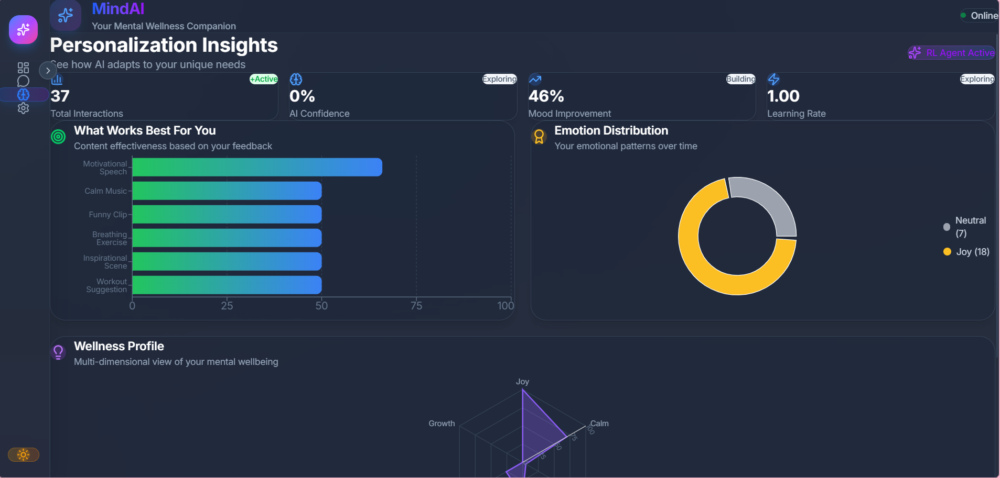
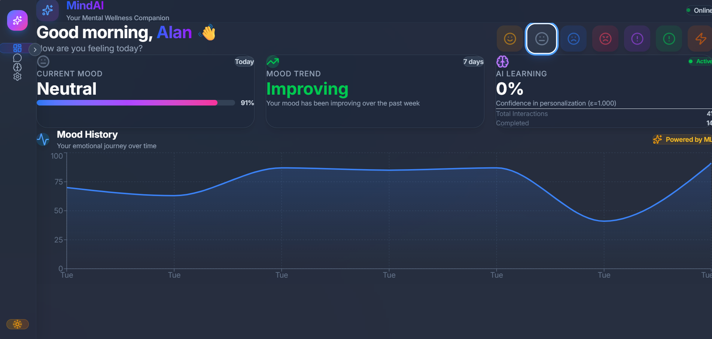

# MindAI - AI-Powered Mental Health Support Application

<p align="center">
  
  
  
  
  
</p>

<p align="center">
  <b>An intelligent mental health companion that uses emotion detection and reinforcement learning to provide personalized support.</b>
</p>

<p align="center">
  <a href="#demo-video">🎥 Watch Demo</a> •
  <a href="#screenshots">📸 Screenshots</a> •
  <a href="#live-demo">🚀 Live Demo</a>
</p>

---

## Demo Video

Watch MindAI in action - from initial conversation to personalized recommendations and analytics:

<p align="center">
  <!-- Replace with your actual demo video link -->
  <a href="https://youtu.be/YOUR_DEMO_VIDEO_ID">
    
  </a>
</p>

<p align="center">
  <i>Click the thumbnail above to watch the full demo on YouTube</i>
</p>

**Demo Highlights:**
- 00:00 - Initial greeting and emotion detection
- 00:45 - Empathetic conversation flow
- 01:30 - Content recommendation with YouTube integration
- 02:15 - Mood feedback and RL learning
- 03:00 - Dashboard with mood tracking
- 03:45 - Insights and analytics visualization

---

## Screenshots

### Chat Interface

<p align="center">
  
</p>

**Features shown:**
- Real-time emotion detection display
- Empathetic AI responses with emotion acknowledgment
- Multimedia content recommendations (YouTube videos)
- Crisis detection with safety resources
- Conversation history and context awareness

---

### Dashboard

<p align="center">
  
</p>

**Features shown:**
- Mood timeline with trend visualization
- Current emotion with confidence score
- Interaction statistics and metrics
- AI learning progress (epsilon value)
- Recent activity feed

---

### Insights Page

<p align="center">
  
</p>

**Features shown:**
- Emotion distribution pie chart
- Content effectiveness analysis
- Wellness radar chart
- Mood improvement trends
- Personalized recommendations history

---

### Dark Mode

<p align="center">
  
</p>

**Features shown:**
- Full dark mode support across all pages
- Consistent theming with CSS variables
- Smooth theme transitions
- Accessible color contrasts

---

## Live Demo

Try MindAI yourself:

🚀 **Coming Soon**: [Live Demo Link](https://your-demo-link.com)

Or run locally in 5 minutes:

```bash
git clone https://github.com/ALAN20SIG/MindAI.git
cd MindAI
pip install -r requirements.txt
cd frontend && npm install && cd ..
python run.py
# In new terminal: cd frontend && npm run dev
```

Then open http://localhost:5173

---

## Table of Contents

- [Demo Video](#demo-video)
- [Screenshots](#screenshots)
- [Live Demo](#live-demo)
- [Overview](#overview)
- [Key Features](#key-features)
- [Technology Stack](#technology-stack)
- [Prerequisites](#prerequisites)
- [Installation](#installation)
- [Usage](#usage)
- [AI Components](#ai-components)
- [Frontend Features](#frontend-features)
- [API Documentation](#api-documentation)
- [Project Structure](#project-structure)
- [Contributing](#contributing)
- [License](#license)
- [Disclaimer](#disclaimer)
- [Adding Screenshots & Demo Video](#adding-screenshots--demo-video)

---

## Overview

MindAI is a comprehensive mental health support application that combines natural language processing, emotion detection, and reinforcement learning to create a supportive environment for mental wellbeing. The system analyzes user messages to detect emotions, engages in empathetic conversation, and recommends relevant multimedia content to help improve mood.

### Why MindAI?

- **Real-time Emotion Detection**: Uses state-of-the-art BERT-based models to detect 7 emotions with high accuracy
- **Personalized Recommendations**: DQN agent learns user preferences over time for tailored content suggestions
- **Conversational Support**: Engages in natural, empathetic dialogue rather than robotic responses
- **Privacy-Focused**: No personal information stored; anonymous user tracking
- **Crisis Detection**: Automatic detection of crisis language with immediate safety resources

---

## Key Features

### Core Capabilities

- **Emotion-Aware Conversations**: Detects and responds to 7 emotions (joy, sadness, anger, fear, neutral, disgust, surprise)
- **Intelligent Content Recommendations**: 6 categories of curated content (motivational speeches, calm music, funny clips, breathing exercises, inspirational scenes, workout suggestions)
- **Reinforcement Learning**: DQN agent improves recommendations based on user feedback
- **Real-time Analytics**: Mood tracking, trend analysis, and personalized insights
- **Crisis Intervention**: Immediate 988 Suicide & Crisis Lifeline referral when needed

### AI-Powered Features

- **BERT-based Emotion Classification**: Fine-tuned DistilRoBERTa model with confidence scoring
- **Dueling Double DQN**: Advanced RL architecture with prioritized experience replay
- **Emotion-Content Matching**: Research-based effectiveness scoring for content selection
- **Contextual Conversation**: Intent detection and progressive engagement flow

---

## Technology Stack

### Backend

| Component | Technology | Purpose |
|-----------|------------|---------|
| Framework | FastAPI | High-performance REST API |
| ML Framework | PyTorch | Deep learning models |
| NLP | Transformers | BERT-based emotion detection |
| Database | SQLite (SQLAlchemy) | User interactions and content storage |
| RL Agent | Custom DQN | Content recommendation learning |

### Frontend

| Component | Technology | Purpose |
|-----------|------------|---------|
| Framework | React 18 | UI components and state management |
| Build Tool | Vite | Fast development and optimized builds |
| Styling | CSS3 + Tailwind | Responsive design |
| Charts | Recharts | Data visualization |
| Animations | Framer Motion | Smooth UI transitions |

### AI/ML Models

- **Emotion Detection**: `j-hartmann/emotion-english-distilroberta-base`
- **RL Architecture**: Dueling Double DQN with Prioritized Experience Replay
- **State Space**: 16-dimensional (7 emotions + 2 time + 6 actions + 1 trend)
- **Action Space**: 6 content categories

---

## Prerequisites

Before installing MindAI, ensure you have the following:

### Required

- **Python**: 3.10 or higher
- **Node.js**: 18.0 or higher
- **npm**: 8.0 or higher (comes with Node.js)
- **Git**: For cloning the repository

### Optional

- **CUDA**: 11.8 or higher (for GPU acceleration)
- **GPU**: NVIDIA GPU with 4GB+ VRAM (recommended for faster inference)

### System Requirements

- **RAM**: 8GB minimum, 16GB recommended
- **Storage**: 2GB free space (for models and dependencies)
- **OS**: Windows 10/11, macOS 12+, or Linux (Ubuntu 20.04+)

---

## Installation

### Step 1: Clone the Repository

```bash
git clone https://github.com/ALAN20SIG/MindAI.git
cd MindAI
```

### Step 2: Set Up Python Environment

```bash
# Create virtual environment
python -m venv venv

# Activate virtual environment
# Windows:
venv\Scripts\activate
# macOS/Linux:
source venv/bin/activate

# Install Python dependencies
pip install -r requirements.txt
```

### Step 3: Set Up Frontend

```bash
# Navigate to frontend directory
cd frontend

# Install Node.js dependencies
npm install

# Return to project root
cd ..
```

### Step 4: Environment Configuration (Optional)

Create a `.env` file in the project root for custom configuration:

```env
# Optional: HuggingFace token for higher rate limits
HF_TOKEN=your_token_here

# Optional: Custom database URL
DATABASE_URL=sqlite:///./mental_health.db

# Optional: Device selection (cpu/cuda)
EMOTION_DEVICE=cpu
```

---

## Usage

### Running the Application

You need to run both the backend and frontend servers simultaneously.

#### Terminal 1: Start Backend Server

```bash
# Ensure virtual environment is activated
python run.py
```

The backend will start on `http://localhost:8000`

You should see:
```
INFO:     Uvicorn running on http://0.0.0.0:8000
INFO:     Application startup complete.
```

#### Terminal 2: Start Frontend Server

```bash
cd frontend
npm run dev
```

The frontend will start on `http://localhost:5173`

You should see:
```
VITE v8.0.0  ready in 912 ms
➜  Local:   http://localhost:5173/
```

### Access the Application

Open your browser and navigate to:

- **Application**: http://localhost:5173
- **API Documentation**: http://localhost:8000/docs
- **API Health Check**: http://localhost:8000/health

### First Time Setup

1. **Open the Chat Interface**: Start a conversation with the AI
2. **Share Your Feelings**: The AI will detect your emotions and respond empathetically
3. **Receive Recommendations**: Based on your emotions, you'll get personalized content suggestions
4. **Provide Feedback**: Rate the content to help the AI learn your preferences
5. **Track Progress**: Visit the Dashboard to see your mood trends over time

---

## AI Components

### 1. Emotion Detection System

**File**: `app/models/emotion_detector.py`

The emotion detection system uses a fine-tuned DistilRoBERTa model to classify text into 7 emotions:

```python
from app.models.emotion_detector import EmotionDetector

detector = EmotionDetector()
result = detector.detect("I'm feeling really anxious about tomorrow")

# Output:
# {
#     "dominant_emotion": "fear",
#     "probabilities": {"joy": 0.02, "sadness": 0.15, "anger": 0.05, 
#                      "fear": 0.65, "neutral": 0.10, "disgust": 0.01, "surprise": 0.02},
#     "intensity": 0.65,
#     "confidence_level": "high",
#     "entropy": 0.42,
#     "mental_health_score": 0.18
# }
```

**Features**:
- **LRU Caching**: Recent detections cached for faster response
- **Confidence Scoring**: Multi-level confidence (high/medium/low/uncertain)
- **Mental Health Context**: Boosts detection of sadness/fear for early intervention
- **Average Inference Time**: ~45ms

### 2. DQN Agent System

**File**: `app/models/dqn_agent.py`

The reinforcement learning agent uses a **Dueling Double DQN** architecture with **Prioritized Experience Replay**:

**Architecture**:
- **Dueling Network**: Separates value and advantage streams for better Q-value estimation
- **Double DQN**: Reduces overestimation bias by decoupling action selection from evaluation
- **Prioritized Replay**: Samples important transitions more frequently based on TD error
- **Soft Target Updates**: Gradual target network updates (tau=0.005) for stable learning

**State Representation** (16 dimensions):
```python
state = [
    # Emotion probabilities (7)
    joy_prob, sadness_prob, anger_prob, fear_prob, 
    neutral_prob, disgust_prob, surprise_prob,
    # Time features (2)
    hour_of_day, day_of_week,
    # Previous actions (6)
    motivational_speech, calm_music, funny_clip,
    breathing_exercise, inspirational_scene, workout,
    # Mood trend (1)
    recent_mood_trend
]
```

**Action Space** (6 categories):
1. Motivational Speech
2. Calm Music
3. Funny Clip
4. Breathing Exercise
5. Inspirational Scene
6. Workout Suggestion

**Reward Shaping**:
```python
reward = (new_mood - old_mood) +           # Base mood improvement
         mood_improvement_bonus +          # +0.2 for >0.3 improvement
         emotion_content_match_bonus -      # +0.15 for good match
         mood_deterioration_penalty         # -0.1 for negative change
```

### 3. Content Recommendation Engine

**File**: `app/content/recommender.py`

The content recommendation engine uses emotion-content effectiveness mapping based on psychological research:

**Emotion-Content Effectiveness Matrix**:

| Emotion | Motivational | Calm Music | Funny | Breathing | Inspirational | Workout |
|---------|-------------|------------|-------|-----------|---------------|---------|
| Sadness | 0.85 | 0.70 | 0.75 | 0.65 | 0.80 | 0.60 |
| Anger | 0.65 | 0.90 | 0.70 | 0.85 | 0.60 | 0.80 |
| Fear | 0.80 | 0.85 | 0.65 | 0.90 | 0.75 | 0.60 |
| Joy | 0.75 | 0.60 | 0.90 | 0.50 | 0.80 | 0.85 |
| Neutral | 0.75 | 0.75 | 0.80 | 0.60 | 0.70 | 0.65 |

**Selection Algorithm**:
1. Get content items for selected category
2. Calculate weights: `weight = effectiveness × recency_penalty × multimedia_boost`
3. Weighted random selection for diversity
4. Update usage history to prevent repetition

---

## Frontend Features

### 1. Chat Interface

**File**: `frontend/src/pages/Chat.jsx`

The chat interface provides an empathetic, conversational experience:

**Features**:
- **Intent Detection**: Recognizes greetings, gratitude, crisis language, negative self-talk
- **Progressive Engagement**: Builds rapport before offering recommendations
- **Context Tracking**: Maintains conversation history and emotion trends
- **Crisis Detection**: Immediate safety resources when crisis language detected
- **Multimedia Content**: Embedded YouTube videos with direct play links

**Conversation Flow**:
```
Message 1: Warm greeting + open-ended question
    ↓
Message 2: Emotion acknowledgment + follow-up
    ↓
Message 3-4: Deepening questions to build rapport
    ↓
Message 5+: Content recommendation (if appropriate)
    ↓
Ongoing: General follow-ups to maintain conversation
```

### 2. Dashboard

**File**: `frontend/src/pages/Dashboard.jsx`

Real-time mood tracking and statistics:

**Features**:
- **Mood Timeline**: Visual chart of mood scores over time
- **Current Mood**: Latest detected emotion with confidence
- **Statistics**: Total interactions, average mood, improvement rate
- **AI Confidence**: Current model confidence (1 - epsilon)
- **Recent Activity**: Latest interactions with timestamps

### 3. Insights

**File**: `frontend/src/pages/Insights.jsx`

Personalized analytics and visualizations:

**Features**:
- **Emotion Distribution**: Pie chart of detected emotions
- **Content Effectiveness**: Bar chart showing which content types work best
- **Wellness Radar**: Multi-dimensional wellness assessment
- **Trend Analysis**: Mood improvement over time
- **Recommendation History**: Past recommendations and ratings

---

## API Documentation

### Base URL
```
http://localhost:8000/api/v1
```

### Endpoints

#### 1. Analyze Emotion

Analyze text to detect emotions.

**Endpoint**: `POST /analyze`

**Request**:
```json
{
  "text": "I'm feeling really happy today!",
  "user_id": "user_abc123"
}
```

**Response**:
```json
{
  "user_id": "user_abc123",
  "emotion": {
    "dominant_emotion": "joy",
    "probabilities": {
      "joy": 0.85,
      "neutral": 0.10,
      "sadness": 0.02,
      "anger": 0.01,
      "fear": 0.01,
      "disgust": 0.005,
      "surprise": 0.005
    },
    "intensity": 0.85,
    "confidence_level": "high",
    "entropy": 0.45,
    "mental_health_score": 0.05,
    "inference_time_ms": 45.2
  },
  "disclaimer": "This system is not a substitute for professional mental health care..."
}
```

#### 2. Get Recommendation

Get personalized content recommendation.

**Endpoint**: `POST /recommend`

**Request**:
```json
{
  "text": "I've been feeling anxious about my exam",
  "user_id": "user_abc123"
}
```

**Response**:
```json
{
  "user_id": "user_abc123",
  "interaction_id": 42,
  "emotion": {
    "dominant_emotion": "fear",
    "probabilities": {...},
    "intensity": 0.72
  },
  "recommended_content": {
    "content_id": 15,
    "category": "breathing_exercise",
    "title": "4-7-8 Breathing Technique",
    "description": "Inhale for 4 seconds, hold for 7 seconds, exhale for 8 seconds...",
    "url": null,
    "effectiveness": 0.90
  },
  "agent_info": {
    "epsilon": 0.35,
    "mode": "exploitation",
    "replay_buffer_size": 156,
    "inference_time_ms": 52.4,
    "confidence_level": "high"
  },
  "disclaimer": "This system is not a substitute for professional mental health care..."
}
```

#### 3. Submit Feedback

Submit mood feedback to improve recommendations.

**Endpoint**: `POST /feedback`

**Request**:
```json
{
  "interaction_id": 42,
  "user_id": "user_abc123",
  "mood_score": 4,
  "feedback_text": "The breathing exercise really helped!"
}
```

**Response**:
```json
{
  "interaction_id": 42,
  "old_mood": 0.72,
  "new_mood": 0.75,
  "reward": 0.03,
  "agent_learned": true,
  "loss": 0.0156,
  "message": "Mood improved!",
  "disclaimer": "This system is not a substitute for professional mental health care..."
}
```

#### 4. Get User History

Retrieve interaction history.

**Endpoint**: `GET /user/{user_id}/history?limit=50&offset=0`

**Response**:
```json
{
  "user_id": "user_abc123",
  "total": 25,
  "interactions": [
    {
      "id": 42,
      "action_taken": 3,
      "action_category": "breathing_exercise",
      "reward": 0.03,
      "old_mood": 0.72,
      "new_mood": 0.75,
      "timestamp": "2024-01-15T10:30:00"
    }
  ],
  "disclaimer": "..."
}
```

#### 5. Get System Metrics

Retrieve system performance metrics.

**Endpoint**: `GET /metrics`

**Response**:
```json
{
  "total_interactions": 156,
  "completed_interactions": 89,
  "avg_reward": 0.045,
  "mood_improvement_pct": 68.5,
  "current_epsilon": 0.35,
  "action_distribution": {
    "motivational_speech": 15,
    "calm_music": 22,
    "funny_clip": 18,
    "breathing_exercise": 12,
    "inspirational_scene": 14,
    "workout_suggestion": 8
  },
  "agent_stats": {
    "avg_reward": 0.045,
    "avg_loss": 0.023,
    "epsilon": 0.35,
    "buffer_size": 156,
    "learn_steps": 42
  },
  "disclaimer": "..."
}
```

---

## Project Structure

```
MindAI/
├── app/                          # Backend application
│   ├── api/                      # FastAPI routes and schemas
│   │   ├── __init__.py
│   │   ├── routes.py             # API endpoints
│   │   └── schemas.py            # Pydantic models
│   ├── content/                  # Content recommendation
│   │   ├── __init__.py
│   │   ├── content_data.json     # Content library
│   │   └── recommender.py        # Recommendation engine
│   ├── database/                 # Database layer
│   │   ├── __init__.py
│   │   ├── crud.py               # Database operations
│   │   ├── db.py                 # Database connection
│   │   └── models.py             # SQLAlchemy models
│   ├── models/                   # AI/ML models
│   │   ├── __init__.py
│   │   ├── dqn_agent.py          # DQN RL agent
│   │   ├── emotion_detector.py   # Emotion detection
│   │   └── state.py              # State representation
│   ├── safety/                   # Safety features
│   │   ├── __init__.py
│   │   └── ethical.py            # Crisis detection
│   ├── __init__.py
│   ├── config.py                 # Configuration settings
│   └── main.py                   # FastAPI application
├── frontend/                     # React frontend
│   ├── src/
│   │   ├── components/           # React components
│   │   │   ├── AICharacter.jsx
│   │   │   ├── CrisisModal.jsx
│   │   │   └── Layout.jsx
│   │   ├── contexts/             # React contexts
│   │   │   └── ThemeContext.jsx
│   │   ├── pages/                # Page components
│   │   │   ├── Chat.jsx
│   │   │   ├── Dashboard.jsx
│   │   │   ├── Insights.jsx
│   │   │   └── Settings.jsx
│   │   ├── App.jsx
│   │   └── main.jsx
│   ├── package.json
│   └── vite.config.js
├── .gitignore
├── requirements.txt              # Python dependencies
├── run.py                        # Backend entry point
└── README.md                     # This file
```

---

## Contributing

We welcome contributions to MindAI! Please see [CONTRIBUTING.md](CONTRIBUTING.md) for detailed guidelines.

### Quick Start for Contributors

1. **Fork the repository**
2. **Create a feature branch**: `git checkout -b feature/amazing-feature`
3. **Make your changes**
4. **Run tests**: `pytest` (backend) and `npm test` (frontend)
5. **Commit changes**: `git commit -m 'Add amazing feature'`
6. **Push to branch**: `git push origin feature/amazing-feature`
7. **Open a Pull Request**

### Areas for Contribution

- Multi-language emotion detection
- Voice input support
- Mobile app development
- Additional content categories
- Enhanced crisis intervention protocols
- Performance optimizations
- Documentation improvements

---

## License

This project is licensed under the MIT License - see the [LICENSE](LICENSE) file for details.

```
MIT License

Copyright (c) 2026 ALAN SUBHASH

Permission is hereby granted, free of charge, to any person obtaining a copy
of this software and associated documentation files (the "Software"), to deal
in the Software without restriction, including without limitation the rights
to use, copy, modify, merge, publish, distribute, sublicense, and/or sell
copies of the Software, and to permit persons to whom the Software is
furnished to do so, subject to the following conditions:

The above copyright notice and this permission notice shall be included in all
copies or substantial portions of the Software.
```

---

## Disclaimer

**IMPORTANT: MindAI is not a substitute for professional mental health care, diagnosis, or treatment.**

### Limitations

- This application is designed to provide **supportive conversations** and **mood-improving content recommendations**
- It **cannot** diagnose mental health conditions
- It **cannot** provide therapy or medical advice
- It **cannot** replace consultation with qualified mental health professionals

### Crisis Resources

If you are in crisis or experiencing thoughts of self-harm or suicide:

- **United States**: Call or text **988** (Suicide & Crisis Lifeline)
- **Emergency**: Call **911** (US) or your local emergency number
- **International**: Find resources at [findahelpline.com](https://findahelpline.com)
- **Immediate Help**: Go to your nearest emergency room

### Privacy Notice

- User IDs are randomly generated and anonymous
- No personally identifiable information (PII) is stored
- Conversation history is stored locally in SQLite database
- Data is not shared with third parties

### User Responsibility

By using this application, you acknowledge that:
- You understand this is not professional mental health care
- You will seek professional help when needed
- You will use crisis resources in emergencies
- The authors are not liable for actions taken based on AI responses

---

## Adding Screenshots & Demo Video

To complete the visual documentation for this README, follow these steps:

### Step 1: Create Directory Structure

```bash
mkdir -p docs/screenshots docs/assets
```

### Step 2: Capture Screenshots

With the application running, capture screenshots of:

1. **Chat Interface** (`docs/screenshots/chat-interface.png`)
   - Start a conversation with the AI
   - Show emotion detection badge
   - Include a content recommendation with YouTube video
   - Resolution: 1920x1080 or higher

2. **Dashboard** (`docs/screenshots/dashboard.png`)
   - Show mood timeline chart
   - Include current emotion card
   - Display statistics section
   - Resolution: 1920x1080 or higher

3. **Insights Page** (`docs/screenshots/insights.png`)
   - Show emotion distribution pie chart
   - Include content effectiveness bars
   - Display wellness radar chart
   - Resolution: 1920x1080 or higher

4. **Dark Mode** (`docs/screenshots/dark-mode.png`)
   - Toggle to dark mode
   - Capture chat interface in dark theme
   - Resolution: 1920x1080 or higher

**Tools for Screenshots:**
- Windows: Snipping Tool, ShareX, or Greenshot
- macOS: Cmd+Shift+5 or CleanShot X
- Browser DevTools: Ctrl+Shift+P → "Capture full size screenshot"

### Step 3: Record Demo Video

Create a 3-5 minute demo video showing:

**Scene 1: Initial Interaction (0:00-0:45)**
- Open the application
- Start a new conversation
- Type: "I've been feeling stressed about work"
- Show emotion detection (fear/anxiety)

**Scene 2: Conversation Flow (0:45-1:30)**
- Continue the conversation
- Show empathetic responses
- Demonstrate context awareness

**Scene 3: Content Recommendation (1:30-2:15)**
- Receive a content recommendation
- Show YouTube video embedding
- Click "Play on YouTube" button

**Scene 4: Feedback & Learning (2:15-3:00)**
- Rate the content (4-5 stars)
- Show "Mood improved!" message
- Explain RL learning in tooltip

**Scene 5: Dashboard & Insights (3:00-3:45)**
- Navigate to Dashboard
- Show mood timeline updating
- Switch to Insights page
- Show analytics visualizations

**Scene 6: Crisis Detection (3:45-4:30)**
- Show crisis detection (optional, use safe language)
- Demonstrate safety resources
- Show crisis modal

**Upload Options:**
- **YouTube**: Upload as unlisted/public video
- **Loom**: Quick sharing with embed
- **GitHub**: Upload to repository releases

### Step 4: Update README Links

After uploading your video, update the README:

```markdown
<!-- In the Demo Video section -->
<a href="https://youtu.be/YOUR_ACTUAL_VIDEO_ID">
  
</a>
```

Create a thumbnail (1280x720) using:
- Canva, Figma, or Photoshop
- Include: App screenshot + Play button overlay + Title

### Step 5: Optimize Images

Compress images before committing:

```bash
# Using ImageMagick
convert screenshot.png -quality 85 -resize 1920x1080 screenshot.png

# Or use online tools:
# - tinypng.com
# - squoosh.app
# - imageoptim.com
```

### Step 6: Commit Assets

```bash
git add docs/
git commit -m "docs: add screenshots and demo video assets"
git push origin main
```

---

## Acknowledgments

- **Emotion Detection Model**: [j-hartmann/emotion-english-distilroberta-base](https://huggingface.co/j-hartmann/emotion-english-distilroberta-base) by Johannes Hartmann
- **FastAPI**: Modern, fast web framework for building APIs
- **React**: Library for building user interfaces
- **PyTorch**: Open source machine learning framework

---

<p align="center">
  <b>Made with ❤️ for mental health awareness</b>
</p>

<p align="center">
  If you find this project helpful, please consider giving it a ⭐ on GitHub!
</p>
